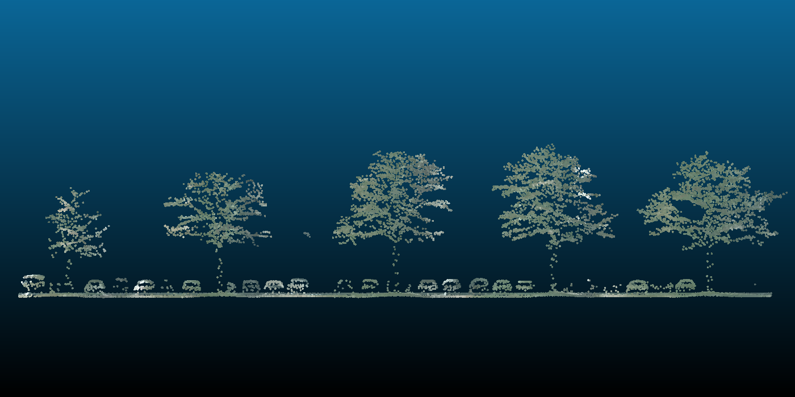
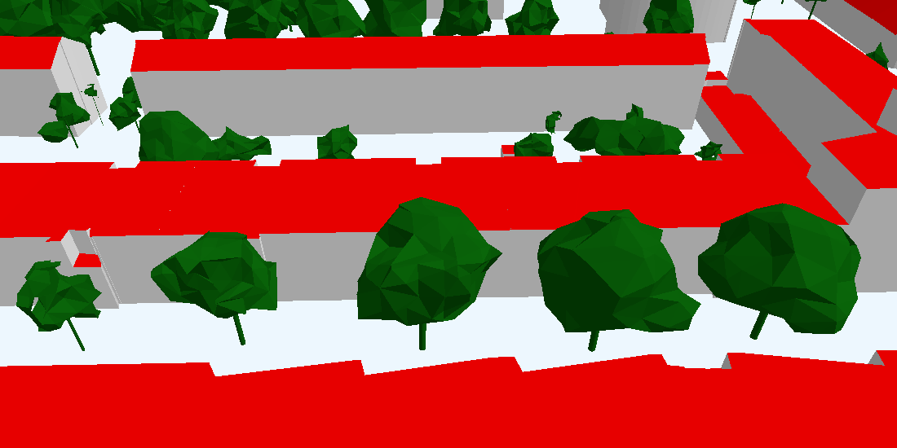

# From Point Clouds to Porous Crowns: A Scalable Approach for CFD-Ready Urban Tree Reconstruction

This repository contains the code accompanying the MSc thesis:
**From Point Clouds to Porous Crowns: A Scalable Approach for CFD-Ready Urban Tree Reconstruction**  
by **Noah Petri Alting**, MSc Geomatics, **TU Delft (2025)**.  
The project presents a fully automated, scalable pipeline that reconstructs CFD-ready 3D tree geometries at the city scale, directly from open-access airborne lidar data [**AHN**](https://www.ahn.nl/).  


## Overview

Urban climate simulations increasingly rely on digital twins of cities, yet vegetation remains largely absent or oversimplified despite its strong influence on wind flow and heat exchange.  
This project introduces a complete end-to-end workflow that reconstructs detailed, watertight, and physically meaningful tree models from raw airborne laser scanning (ALS) point clouds.  

<p align="center">
  
  
</p>


## Pipeline Overview

The pipeline operates directly on unstructured lidar data and consists of three major components:

1. **Data acquisition** — Automatic download, clipping, and preprocessing of AHN tiles for a user-defined area.  
2. **Segmentation** — Novel *High-Order Multi-Echo Density (HOMED)* vegetation filtering and per-tree clustering via a modified [*TreeSeparation algorithm*](https://github.com/Jinhu-Wang/TreeSeparation) algorithm.  
3. **Reconstruction** — Generation of CFD-ready watertight geometries (crown and trunk) using CGAL-based α-wrapping and per-tree metric extraction.

The workflow has been applied to several major Dutch cities, including Amsterdam, Rotterdam, Utrecht, and Delft, reconstructing over 380,000 trees within practical runtimes (~13 hours for Amsterdam on 16 CPU cores).


## Repository Structure
``` bash
CFTree/
├── cases/ # Case definitions and logs per study area
├── data/ # Intermediate and final outputs per case
├── resources/ # Static reference datasets (e.g., AHN tile index)
├── scripts/ # Orchestration scripts for each pipeline step
└── src/ # Core modules (data, segmentation, reconstruction)
```

## Pipeline Workflow

### 1. Data Acquisition (`get_data`)
- Input: `cases/<case_name>/city_bbox.geojson`
- Downloads and clips AHN5 LiDAR tiles and digital terrain models (DTM) for the specified area.
- Outputs stored under `data/<case_name>/tiles/<tile_id>/`.

### 2. Tree Segmentation (`segmentation`)
- Applies the **HOMED** vegetation filter to isolate vegetation points.
- Segments individual trees using a modified [**TreeSeparation algorithm**](https://github.com/Jinhu-Wang/TreeSeparation) (C++).
- Produces per-tree point clusters and a harmonized forest-level point cloud (`forest.laz`) with global tree identifiers (`gtid`).

### 3. Geometry Reconstruction (`reconstruction`)
- For each segmented tree:
  - Generates local coordinate systems for efficiency.
  - Reconstructs watertight meshes using the [**CGAL 3D Alpha Wrapping algorithm**](https://doc.cgal.org/latest/Alpha_wrap_3/index.html#Chapter_3D_Alpha_wrapping).
  - Derives morphological attributes (e.g., crown width, height, trunk dimensions).
  - Constructs LOD3-level crown and trunk geometries.
- Exports per-tile CityJSON files with full geometric and attribute information.

For detailed execution instructions, see `/scripts/README.md`.

## Installation

This repository uses a Conda environment for reproducibility.

```bash
conda env create -f environment.yml
conda activate cftree
```
Ensure sufficient storage capacity (≥100 GB recommended for full-city processing).
The data path can be configured in `src/config.py`.


## Quickstart example

### 1. Define your area of interest in:
```bash 
cases/<case_name>/city_bbox.geojson
```
### 2. Set case variables in `src/config.py`, defaults for example run are:
``` python
# ---------------------------------------------------------------------
# Case configurations used throughout the pipeline
# ---------------------------------------------------------------------
CASE_CONFIGURATIONS = {
    "case_root": Path("cases"),             # user case input directory
    "data_root": Path("data"),              # data storage root (large files)
    "resources_dir": Path("resources/AHN_subunits_GeoTiles"),
    "case": "wippolder",                    # test case
    "default_cores": 2,                     # Global default for parallelization
    "crs": "EPSG:28992",                    # Amersfoort / RD New
}
```

### 3. Build the cpp files.
Detailed instructions see `src/segmentation/TreeSeparation/README.md` and `src/reconstruction/AlphaWrap/README.md`.

### 4. Run the full pipeline:
``` bash
python -m scripts.get_data
python -m scripts.segmentation
python -m scripts.tree_reconstruction
```
If desired, each stage can be overwritten:
``` bash
--case <path>                       # path to case to run
--n-cores <number_of_cores>         # number of available cores for paralellisation
--log-level <[INFO, WARNING, DEBUG] # log detail level
--overwrite                         # overwrite existing files
--dry-run                           # only list tiles
```
Logs for each run are stored under:
``` bash
cases/<case_name>/logs/
```

## Outputs
Each fully processed tile will contain:
``` bash
clipped.laz
clipped_dtm.tif
vegetation.laz
vegetation.xyz
segmentation.xyz
forest.laz
tree_hulls.geojson
trees_lod3.city.json
```
Case-level aggregated outputs:
``` bash
data/<case_name>/forest_hulls.geojson
data/<case_name>/gtid_map.csv
```

## Performance
| City      | # Trees | Runtime (16 cores) | Notes                       |
| --------- | ------- | ------------------ | --------------------------- |
| Amsterdam | ~380k   | ~13 h              | Full pipeline, AHN5 dataset |
| Rotterdam | ~210k   | ~7 h               |                             |
| Utrecht   | ~150k   | ~5 h               |                             |
| Delft     | ~90k    | ~3 h               |                             |


## Acknoledgements
This repository is part of my MSc thesis:
“From Point Clouds to Porous Crowns: A Scalable Approach for CFD-Ready Urban Tree Reconstruction.”
at the Delft University of Technology, Faculty of Architecture and the Built Environment.
Available soon at: https://repository.tudelft.nl/

Supervised by: Dr. Hugo Ledoux and Dr. Clara García Sánchez

## license
???